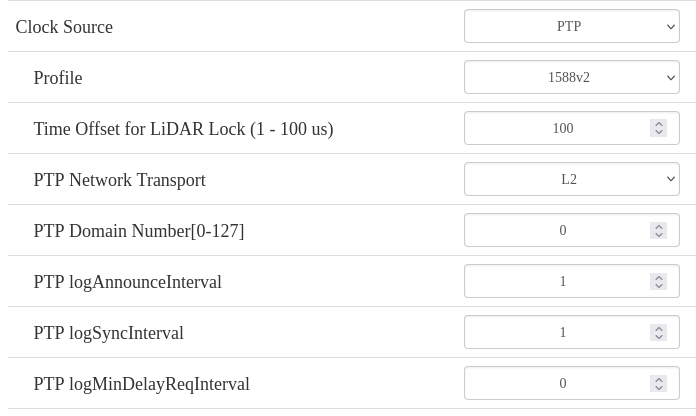
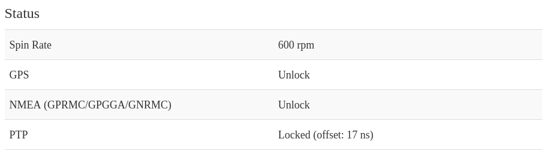

# Prerequsities

User name : pi
Ros 2 version : Jazzy
Ros 2 worskpace  cloned to : /home/pi/mandeye_pandar_ros2
Hesai laser connected to eth0.


## Setup Xsense

```
sudo adduser mandeye dialout
```

## Disable Rviz2
```
cd /home/pi/mandeye_pandar_ros2/src/HesaiLidar_ROS_2.0
git apply /home/pi/mandeye_pandar_ros2/Heasai.patch
```

## Set timestamping to software 
```
cd /home/pi/mandeye_pandar_ros2/src/Xsens_MTi_ROS_Driver_and_Ntrip_Client
git apply /home/pi/mandeye_pandar_ros2/xens.patch
```


## Build ROS 2 workspace

```
cd /home/pi/mandeye_pandar_ros2
source /opt/ros/jazzy/setup.sh
git submodule update --init --recursive
colcon build
```


## Create PTP server config
```
sudo apt-get update && sudo apt-get install linuxptp
```
and create config:

```
sudo vim /etc/linuxptp/gm-l2.conf
```
and add content:
```
[global]
serverOnly            1         
time_stamping         hardware
network_transport     L2    
delay_mechanism       E2E
domainNumber          0
twoStepFlag           1
summary_interval      1
logAnnounceInterval   1
logSyncInterval       0
summary_interval      1
[eth0]
```

# Services

## Install services for ROS 2 drivers and PTP

```
sudo cp /home/pi/mandeye_pandar_ros2/services/*.service /etc/systemd/system/

```

### Start those 
```
sudo systemctl daemon-reload
sudo systemctl enable --now mandeye_ptp4l-gm-eth0.service
sudo systemctl enable --now mandeye_phc2sys-gm-eth0.service
sudo systemctl enable --now mandeye_ros2_hesai.service
sudo systemctl enable --now mandeye_ros2_mandeye.service

```

```
sudo systemctl status mandeye_ptp4l-gm-eth0.service
sudo systemctl status mandeye_phc2sys-gm-eth0.service
sudo systemctl status mandeye_ros2_hesai.service
sudo systemctl status mandeye_ros2_xsense.service
sudo systemctl status mandeye_ros2_mandeye.service

```

### Check logs
```
journalctl -u mandeye_ptp4l-gm-eth0 -n 50 -e | tail
journalctl -u mandeye_phc2sys-gm-eth0 -n 50 -e | tail
journalctl -u mandeye_ros2_hesai -n 50 -e | tail
journalctl -u mandeye_ros2_xsense -n 50 -e | tail
```

### Setup Lidar
Set Clock source to PTP and choose network transport "L2". 


### Test




# Build and install Mandeye driver

Please make install of mandeye driver with ROS 2 enabled. 
But disable mandeye_controller:
```
mandeye_stop
```
## Hesain jt16

- apply patch (Hesai_jt16.patch)
- adjust ROS 2 integration to use other imu topic in mandeye controller
- rebuild and install mandeye controller
